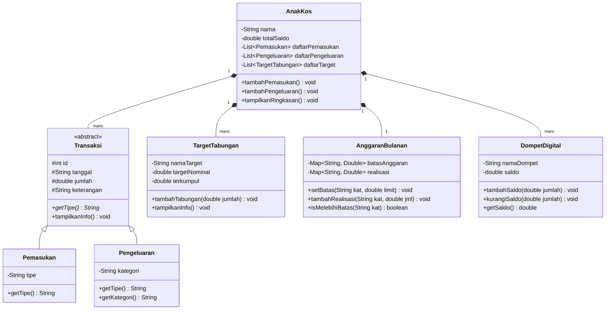

# MoneyKos — Aplikasi Manajemen Keuangan Anak Kos

**Nama:** Nayla Aisha Hanifa

**NRP:** 5027251075

---
## Deskripsi Kasus

### Latar Belakang

Setelah saya menjalani sebagai anak rantau, menjadi mahasiswa perantauan bukanlah suatu hal mudah. Selain harus berjuang dengan tugas kuliah, ujian, dan kehidupan serta lingkungan yang serba baru, ada satu tantangan yang sering kali bikin pusing dan menambah pikiran yaitu tentang **mengelola uang bulanan**.


### Masalah yang Menumpuk

- Tidak Ada Catatan Real-Time: Nayla tidak sadar bahwa akumulasi pengeluaran kecil seperti jajan nasi kuning dan kopi bisa membengkak.
- Ambisi Finansial yang Terhambat: Nayla ingin membeli iPad Pro M2 untuk menunjang desain UI/UX dan mengoleksi blind box Hirono, namun tabungannya tidak pernah terkumpul karena selalu terpakai untuk "keadaan darurat" yang sebenarnya bisa dihindari.
- Overbudgeting: Nayla sering melampaui anggaran hiburan tanpa peringatan, sehingga uang jatah pendidikan atau kost sering terpakai.


### Konsep MoneyKos

Saya ingin merancang sebuah program berbasis OOP dengan nama **MoneyKos**. Sebuah sistem simulasi yang menjawab semua masalah saya diatas, isi dari moneykos:

1. **Dompet digital** 
Mencatat semua saldo yang ada. Baik tunai, dibank mobile ataupun digopay.


2. **Pencatatan pemasukan** 
dari kiriman bulanan

3. **Pencatatan pengeluaran** 
yang dikategorikan: makanan, kebutuhan kos, hiburan, dan pendidikan.

4. **Anggaran bulanan** 
setiap kategori punya batas maksimal. Jika sudah melebihi batas, sistem langsung memberi peringatan saat itu juga.

5. **Target tabungan**  
Ada nama tujuan, nominal target, dan progress bar-nya.

6. **Validasi saldo** 
sistem menolak pengeluaran yang melebihi saldo. 

7. **Laporan bulanan** 
breakdown pengeluaran per kategori dan evaluasi anggaran tersedia untuk setiap bulan.

### Komponen dalam Sistem

**`AnakKos`** adalah kelas inti yang mewakili saya(Nayla) sebagai pengguna. Menyimpan semua data keuangan — dompet, pemasukan, pengeluaran, tabungan, anggaran — dan menjadi pusat seluruh operasi.

**`Transaksi`** adalah abstract class sebagai kerangka umum untuk semua pencatatan uang. Dua subclass-nya — `Pemasukan` dan `Pengeluaran` — mewarisi atribut dasarnya namun memiliki atribut tambahan yang berbeda.

**`DompetDigital`** memberikan informasi sumber uang saya. Saldo dari semua dompet baik tunai ataupun nontunai menjadi saldo awal sistem.

**`AnggaranBulanan`** menyimpan batas pengeluaran per kategori menggunakan `Map`, sekaligus mencatat realisasinya. Setiap bulan memiliki instance anggarannya sendiri.

**`TargetTabungan`** menampilkan target yang ingin saya capai masing-masing dengan nominal target, jumlah yang sudah terkumpul, dan progress bar visual.


---

## Class Diagram



---

## Kode Program Java

Seluruh implementasi dalam satu file:

- [`App.java`](./App.java)

### Cara Menjalankan

```bash
javac -d bin App.java
java -cp bin App
```

### Highlight Kode Penting

**1. `Transaksi` sebagai abstract class dengan method abstract `getTipe()`**

```java
abstract class Transaksi {
    protected int    id;
    protected String tanggal;
    protected double jumlah;
    protected String keterangan;

    public abstract String getTipe(); // wajib diimplementasikan subclass

    public void tampilkanInfo() {
        System.out.printf("    [#%02d | %-6s] %s | %-30s | Rp %,.0f%n",
                id, getTipe(), tanggal, keterangan, jumlah);
    }
}
```

> `Transaksi` menjadi kontrak bersama untuk `Pemasukan` dan `Pengeluaran`. Method `getTipe()` dibuat abstract sehingga setiap subclass wajib menyatakan tipe-nya sendiri. Sedangkan `tampilkanInfo()` cukup ditulis sekali di sini dan langsung diwarisi oleh kedua subclass.

---

**2. `Pemasukan` dan `Pengeluaran` sebagai subclass konkret**

```java
class Pemasukan extends Transaksi {
    private String tipe; // contoh: "Kiriman Ortu"

    @Override
    public String getTipe() { return "MASUK"; }
}

class Pengeluaran extends Transaksi {
    private String kategori; // contoh: "Makanan", "Hiburan"

    @Override
    public String getTipe() { return "KELUAR"; }
    public String getKategori() { return kategori; }
}
```

> Masing-masing hanya perlu menambahkan satu atribut unik dan mengimplementasikan `getTipe()`. Atribut `id`, `tanggal`, `jumlah`, `keterangan`, serta `tampilkanInfo()` sudah diwarisi dari `Transaksi` tanpa perlu ditulis ulang.

---

**3. `DompetDigital` untuk mengelola saldo dari berbagai sumber**

```java
class DompetDigital {
    private String namaDompet;
    private double saldo;

    public DompetDigital(String namaDompet, double saldoAwal) {
        this.namaDompet = namaDompet;
        this.saldo      = saldoAwal;
    }
}
```

```java
// Di AnakKos — saldo awal dihitung dari semua dompet yang didaftarkan
public void tambahDompet(DompetDigital dompet) {
    daftarDompet.add(dompet);
    totalSaldo += dompet.getSaldo();
}
```

> Uang Rafi tersebar di tiga tempat berbeda. Dengan mendaftarkan setiap dompet ke sistem, saldo awal yang diperhitungkan sudah merangkum ketiganya sekaligus — bukan hanya satu rekening.

---

**4. `AnggaranBulanan` menggunakan `Map` — satu instance per bulan**

```java
public void mulaiAnggaranBulan(String bulan) {
    anggaranAktif = new AnggaranBulanan();
    historiAnggaran.put(bulan, anggaranAktif); // disimpan dengan kunci nama bulan
}
```

```java
public boolean isMelebihiBatas(String kat) {
    if (!batasAnggaran.containsKey(kat)) return false;
    return realisasi.getOrDefault(kat, 0.0) > batasAnggaran.get(kat);
}
```

> Dengan menyimpan setiap `AnggaranBulanan` ke dalam `Map<String, AnggaranBulanan>`, laporan Maret dan April bisa ditampilkan secara terpisah kapan saja — bukan hanya di akhir simulasi.

---

**5. Alert anggaran real-time saat pengeluaran melebihi batas**

```java
anggaranAktif.tambahRealisasi(kategori, jumlah);
if (anggaranAktif.isMelebihiBatas(kategori)) {
    double real  = anggaranAktif.getRealisasi().get(kategori);
    double batas = anggaranAktif.getBatasAnggaran().get(kategori);
    System.out.printf("  [ALERT]  Anggaran \"%s\" melebihi batas! (Rp %,.0f / Rp %,.0f)%n",
            kategori, real, batas);
}
```

> Alert muncul tepat saat transaksi terjadi — bukan hanya saat laporan bulanan dibuka. Ini memberi umpan balik langsung kepada pengguna sebelum pengeluaran semakin membengkak.

---

**6. Validasi saldo sebelum mencatat pengeluaran atau menabung**

```java
public void tambahPengeluaran(...) {
    if (jumlah > totalSaldo) {
        System.out.printf("  [DITOLAK] \"%s\" — butuh Rp %,.0f, saldo hanya Rp %,.0f%n",
                keterangan, jumlah, totalSaldo);
        return;
    }
    // lanjut proses...
}
```

> Transaksi yang melebihi saldo langsung ditolak dengan pesan yang menjelaskan berapa yang dibutuhkan dan berapa yang dimiliki. Ini mencegah kondisi saldo negatif dan mensimulasikan perilaku kartu debit.

---

**7. Polymorphism saat menampilkan riwayat transaksi**

```java
List<Transaksi> semua = new ArrayList<>();
semua.addAll(daftarPemasukan);   // Pemasukan dimasukkan sebagai Transaksi
semua.addAll(daftarPengeluaran); // Pengeluaran dimasukkan sebagai Transaksi
semua.sort(Comparator.comparingInt(Transaksi::getId));

for (Transaksi t : semua) t.tampilkanInfo(); // polymorphism
```

> `Pemasukan` dan `Pengeluaran` digabung ke satu `List<Transaksi>`, lalu diurutkan berdasarkan ID. Saat `tampilkanInfo()` dipanggil, Java otomatis menjalankan versi yang tepat berdasarkan tipe objek aslinya.

---

**8. Progress bar ASCII di `TargetTabungan`**

```java
private String buatProgressBar(double persen) {
    int terisi = (int) Math.min(persen / 100 * 20, 20);
    StringBuilder bar = new StringBuilder("[");
    for (int i = 0; i < 20; i++) bar.append(i < terisi ? "=" : "-");
    bar.append("]");
    return bar.toString();
}
```

> Progress tabungan ditampilkan sebagai bar visual `[========------------]` sehingga seberapa dekat Rafi dengan targetnya langsung terasa intuitif tanpa harus menghitung sendiri.

---

## Screenshot Output


---

## Prinsip OOP yang Diterapkan

### 1. Abstraction
`Transaksi` dibuat sebagai abstract class yang mendefinisikan struktur umum sebuah pencatatan uang. Method `getTipe()` bersifat abstract karena setiap subclass memiliki tipe yang berbeda. Kode yang memproses daftar transaksi tidak perlu mengetahui apakah objeknya `Pemasukan` atau `Pengeluaran` — cukup panggil `tampilkanInfo()`.

### 2. Inheritance
`Pemasukan` dan `Pengeluaran` mewarisi `Transaksi`. Keduanya otomatis mendapatkan atribut `id`, `tanggal`, `jumlah`, `keterangan`, serta method `tampilkanInfo()` tanpa menulis ulang. Masing-masing hanya menambahkan atribut yang unik: `Pemasukan` menambah `tipe`, `Pengeluaran` menambah `kategori`.

### 3. Encapsulation
Semua atribut di seluruh class menggunakan access modifier `private` atau `protected`. Saldo di `AnakKos` hanya bisa berubah melalui method resmi `tambahDompet()`, `tambahPemasukan()`, `tambahPengeluaran()`, atau `simpanKeTarget()` — tidak bisa diubah langsung dari luar class.

### 4. Polymorphism
`Pemasukan` dan `Pengeluaran` digabungkan ke satu `List<Transaksi>` saat menampilkan riwayat. Method `tampilkanInfo()` dipanggil secara seragam pada semua elemen, namun Java otomatis menjalankan versi yang tepat berdasarkan tipe objek aslinya. Begitu pula `getTipe()` yang menghasilkan `"MASUK"` atau `"KELUAR"` secara berbeda meski dipanggil dari referensi bertipe `Transaksi`.

---

## Keunikan Program

### 1. Laporan Tersedia Per Bulan, Bukan Hanya di Akhir
Sistem menyimpan instance `AnggaranBulanan` di dalam `Map<String, AnggaranBulanan>` berdasarkan nama bulan. Dengan begitu, laporan breakdown dan evaluasi anggaran bisa ditampilkan untuk Maret maupun April secara terpisah — mencerminkan cara kerja aplikasi keuangan nyata.

### 2. Saldo Awal dari Banyak Dompet
Melalui class `DompetDigital`, saldo awal Rafi diperhitungkan dari tiga sumber: uang tunai, rekening bank, dan GoPay. Ini lebih realistis dibanding sekadar menginput satu angka saldo awal.

### 3. Alert Anggaran Real-Time
Pelanggaran anggaran terdeteksi **tepat saat transaksi terjadi**, bukan hanya saat laporan dibuka. Pengguna langsung tahu di mana pengeluarannya membengkak.

### 4. Progress Bar Visual untuk Tabungan Bertujuan
Setiap target tabungan ditampilkan dengan progress bar ASCII `[========------------]` yang membuat progres terasa intuitif dan memotivasi.

---

